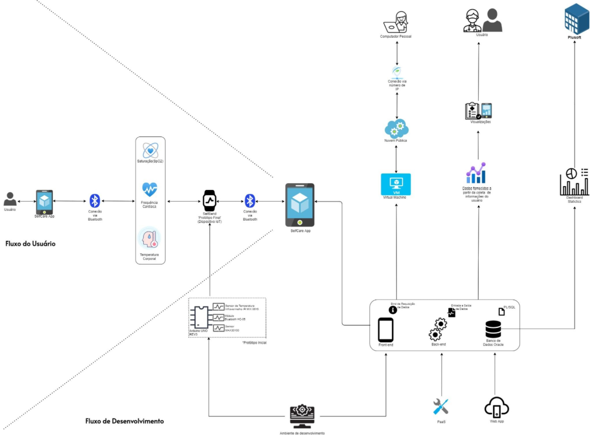

<h1 align="center">
    
</h1>

<h3 align="center">
  SelfCare
</h3>

 
 

  <a href="#sobre">Sobre</a>&nbsp;&nbsp;&nbsp;|&nbsp;&nbsp;&nbsp;
  <a href="#layout">Layout</a>&nbsp;&nbsp;&nbsp;|&nbsp;&nbsp;&nbsp;
  <a href="#tecnologias">Tecnologias</a>&nbsp;&nbsp;&nbsp;|&nbsp;&nbsp;&nbsp;
  <a href="#como-contribuir">Como contribuir</a>&nbsp;&nbsp;&nbsp;|&nbsp;&nbsp;&nbsp;
  <a href="#licença">Licença</a>

  

## Sobre 
#### Objetivo e Escopo
O principal objetivo da aplicação SelfCare parte da premissa de oferecer 
ao maior número de usuários possível, um meio seguro, prático e acessível 
para que estes possam cuidar melhor de sua saúde e bem-estar ao longo de sua vida. 
O produto será um dispositivo semelhante a uma pulseira, nomeada 
“CareBand”, que atuará em conjuto com um conjunto de sensore, 
monitorando e coletando dados vitais de seu usuário.   
Os dados coletados poderão ser utilizados pelos profissionais da saúde 
para investigar possíveis patologias presentes no organismo do indivíduo, além de 
possibilitar que o usuário detecte antecipadamente qualquer anormalidade ou 
irregularidade significativa em seus sinais vitais, dessa forma, evitando o 
agravamento de uma comorbidade ou distúrbio, aumentando as chances de sucesso 
decorrentes do tratamento precoce do respectivo diagnóstico. 
A aplicação SelfCare também contará com um aplicativo, inicialmente disponibilizado 
para Android, capaz de se conectar-se via Bluetooth com o dispositivo CareBand e captar 
as informações aferidas pelos sensores, armazenando-as de forma organizada e 
inteligente em uma sólida base de dados, permitindo que sejam visualizadas e 
consultadas pelo usuário de maneira intuitiva, conforme sua necessidade.

#### Arquitetura

  

#### End Points
#### Funcionalidades

## Layout

## Tecnologias

Esse projeto foi desenvolvido com as seguintes tecnologias:

## Como contribuir

- 1) Faça um fork desse repositório.
- 2) Crie uma branch com a sua feature: `git checkout -b minha-feature`;
- 3) Faça commit das suas alterações: `git commit -m 'feat: Minha nova feature'`;
- 4) Faça push para a sua branch: `git push origin minha-feature`.

Após o merge do seu pull-request for feito, você pode deletar a sua branch.

## Licença

Esse projeto está sob a licença MIT. Consulte o arquivo [LICENSE](https://github.com/pedromiguelsbs/nlw_01/blob/main/LICENSE) para mais detalhes.
